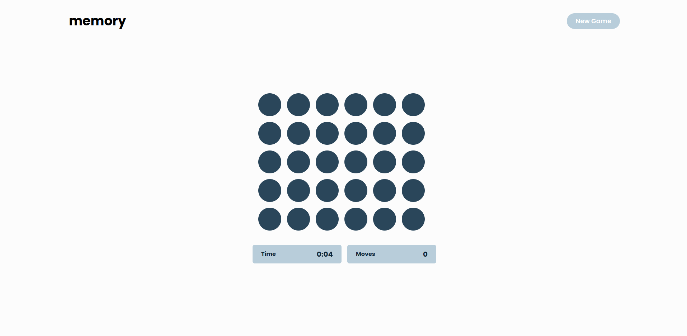

# Memory Game

Memory Game is a web-based game where players test their memory skills by matching pairs of cards.



## Levels

The game features three levels of difficulty:

- **Easy**: 8 pairs of cards
- **Medium**: 12 pairs of cards
- **Hard**: 15 pairs of cards

## Game Rules

- Click on two cards to reveal their icons.
- If the icons match, the cards stay face-up. Otherwise, they flip back face-down.
- The goal is to match all pairs with the fewest moves and in the shortest time.

## Move Count

In this game, the move count is used as a measure of your performance. Fewer moves are better, as it indicates a better memory and faster completion time.

## Local Development

To set up the project locally, follow these steps:

1. Clone the repository:

```sh
git clone https://github.com/Rviewer-Challenges/mQ9a3ZnUlTFRxfuh10hc
```

2. Navigation to the folder

```sh
cd mQ9a3ZnUlTFRxfuh10hc/memory-game-app
```

3. Install the dependencies:

```sh
yarn install or npm install
```

4. Start the development server:

```sh
npm run dev or yarn dev
```

5. Open your web browser and go to [http://localhost:3000](http://localhost:3000) to play the game.

## Technologies Used

- React
- Next.js
- Typescript
- Tailwindcss

## Credits

This game was developed by Grace Nshokano Birindwa. If you have any questions or feedback, please contact [grace.devolop@gmail.com].

Enjoy the game!